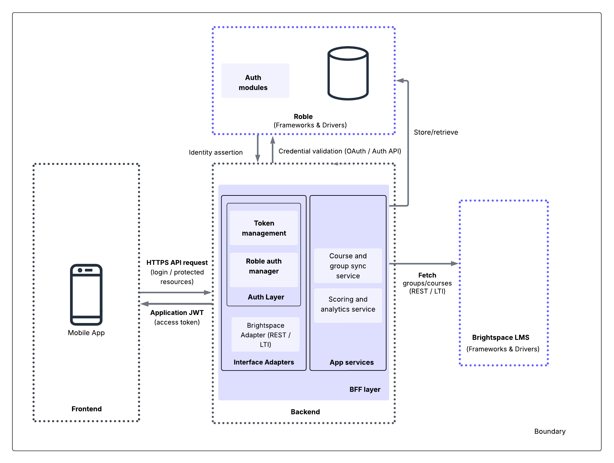
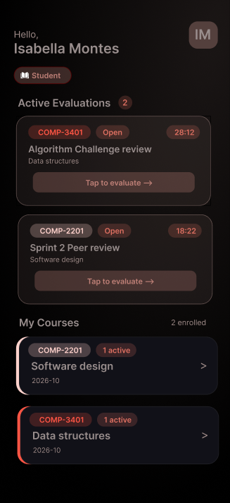
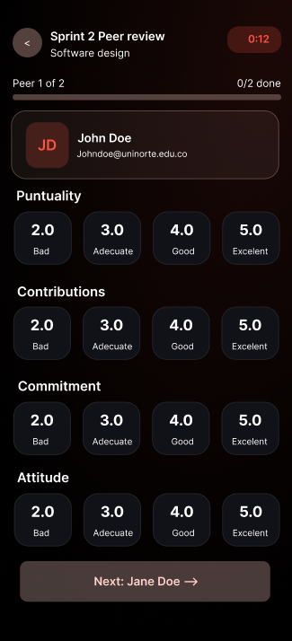
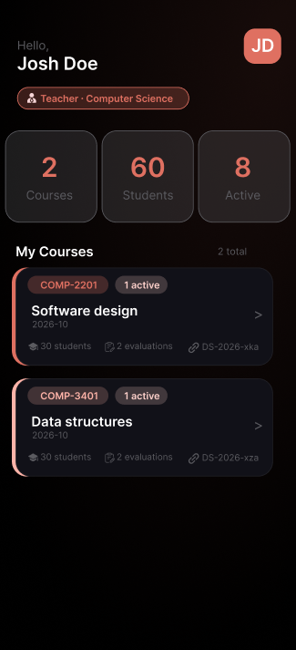

# Evaluo

**Fair, structured, and transparent peer assessment for academic collaboration.**

[Overview](#-overview) · [Features](#-features) · [Architecture](#-architecture) · [Design](#-design) · [References](#-existing-solutions)

---

## Descripción de la aplicación

**Evaluo** es una aplicación móvil desarrollada en Flutter para gestionar procesos de **evaluación entre pares** en cursos universitarios. La plataforma centraliza en una sola app los flujos de estudiantes y docentes, permitiendo crear actividades de evaluación, diligenciar valoraciones por compañeros y consultar resultados con métricas accionables.

### Propósito

Mejorar la transparencia, trazabilidad y equidad en el trabajo colaborativo académico, facilitando que:

- Los estudiantes evalúen a sus compañeros con criterios claros y homogéneos.
- Los docentes monitoreen el desempeño individual y grupal con evidencia cuantitativa y cualitativa.
- El proceso de evaluación se integre al ciclo normal del curso con autenticación segura y datos persistentes.

### Funcionalidades principales

- **Autenticación y gestión de sesión por roles**
  - Inicio de sesión, registro y validación de sesión.
  - Separación de experiencia para estudiante y docente desde el acceso principal.

- **Vista de inicio para estudiante**
  - Consulta de cursos inscritos.
  - Visualización de evaluaciones activas pendientes.
  - Filtrado de evaluaciones ya respondidas para evitar duplicados.

- **Vista de inicio para docente**
  - Consulta de cursos asignados.
  - Resumen de cantidad de cursos, estudiantes y evaluaciones activas por curso.

- **Gestión de cursos y grupos**
  - Consulta de evaluaciones y categorías de grupo por curso.
  - Importación de grupos desde archivos CSV.

- **Creación de evaluaciones**
  - Configuración de nombre, curso, categoría de grupo, fecha límite y visibilidad (pública/privada).
  - Actualización de información del curso tras crear una evaluación.

- **Formulario de coevaluación**
  - Evaluación por pares del mismo grupo.
  - Criterios estructurados: puntualidad, contribuciones, compromiso y actitud.
  - Escala de calificación y campo de comentarios opcionales.
  - Envío de respuestas por cada compañero evaluado.

- **Analíticas y resultados**
  - Para estudiantes: promedio por criterio, promedio general y comentarios recibidos.
  - Para docentes: métricas agregadas por actividad, por grupo y por estudiante, con detalle de comentarios.

- **Soporte técnico de datos**
  - Consumo de API con manejo de token y refresco automático de sesión.
  - Caché local por módulos para mejorar tiempos de carga.
  - Cierre automático de evaluaciones vencidas según fecha límite.

### Alcance

Evaluo está orientada a contextos académicos de educación superior donde se requiere evaluación de trabajo en equipo con seguimiento docente. En su alcance actual, la aplicación cubre el ciclo de autenticación de usuarios, consulta de cursos y evaluaciones por rol, configuración e importación de grupos, creación y diligenciamiento de evaluaciones entre pares, y consulta de resultados analíticos para estudiantes y docentes.

No busca reemplazar un LMS completo, sino complementar el curso con un módulo especializado de coevaluación estructurada y análisis de desempeño.

## Demo Videos

 

## Overview

**Evaluo** is a mobile application built with **Flutter** that enables fair, structured peer assessment in collaborative academic environments. Designed for university courses, it allows students to evaluate teammates based on predefined criteria while giving instructors actionable insights into both group and individual performance.

> Built on real feedback from faculty at **Universidad del Norte**, Evaluo addresses transparency, accountability, and trust gaps in collaborative learning.

---

## Features

| Feature                  | Description                                                     |
| ------------------------ | --------------------------------------------------------------- |
| **Role-based Access**    | Single app with distinct flows for students and instructors     |
| **Structured Rubrics**   | Predefined evaluation criteria for consistent, fair assessments |
| **Performance Insights** | Detailed metrics on individual and group contributions          |
| **Team Management**      | Automatic group formation and contribution tracking             |

---

## Architecture

  

 

Evaluo follows a **decoupled architecture** that separates frontend concerns from backend services, enabling:

- **Scalability** — independent scaling of frontend and backend layers
- **Maintainability** — clear separation of concerns across the codebase
- **Security** — role-based access control with properly secured endpoints
- **Flexibility** — backend services can evolve independently of the mobile client

> **Design decision:** A single unified application with role-based access was chosen over multiple independent apps to avoid duplicated business logic, reduce maintenance costs, and improve long-term scalability. This proposal was validated through interviews with faculty from the Systems Engineering Department at Universidad del Norte: Daniel Romero, Eduardo Angulo and Wilson Nieto.

---

## Design

The UI/UX was designed in Figma with a strong emphasis on clarity, accessibility, and ease of use for both students and instructors.

  
  &nbsp;&nbsp;
  
  &nbsp;&nbsp;
  
  &nbsp;&nbsp;
  

---

## Existing Solutions

Research into existing peer assessment platforms informed Evaluo's design and feature set.

<strong>Kritik 360</strong> — AI-powered rubric generation & anonymous peer review

 

An educational platform that enhances student engagement through peer-to-peer assessment with predefined rubrics. Its standout feature is an **AI-powered Course Creator** that generates assignments and rubrics from a syllabus upload. Anonymous evaluations reduce bias and promote objective feedback.

🔗 [kritik.io/kritik360](https://www.kritik.io/kritik360)

<strong>FeedbackFruits</strong> — LMS-integrated peer assessment with AI-assisted feedback

 

An LMS-integrated platform (Canvas, Brightspace) that streamlines peer assessment, self-evaluation, and structured feedback. Features AI-assisted feedback generation and automated workflows that reduce administrative workload significantly.

🔗 [feedbackfruits.com](https://feedbackfruits.com)

<strong>Peerceptiv</strong> — Research-backed collaborative evaluation platform

 

Supported by over two decades of academic research, Peerceptiv focuses on anonymous evaluation and measurement of individual contributions within team projects. Students assess peers on professionalism, communication, and work ethic.

🔗 [peerceptiv.com](https://peerceptiv.com)

---

## Status

Evaluo is currently under **active development** as an academic project. Contributions and feedback are welcome.

---

Made with ❤️ at **Universidad del Norte**

